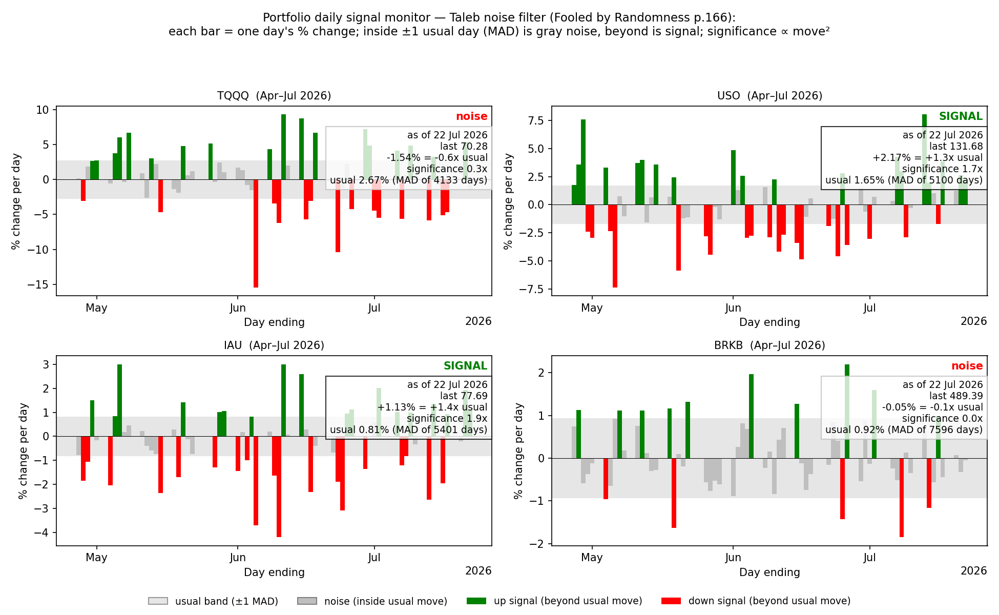
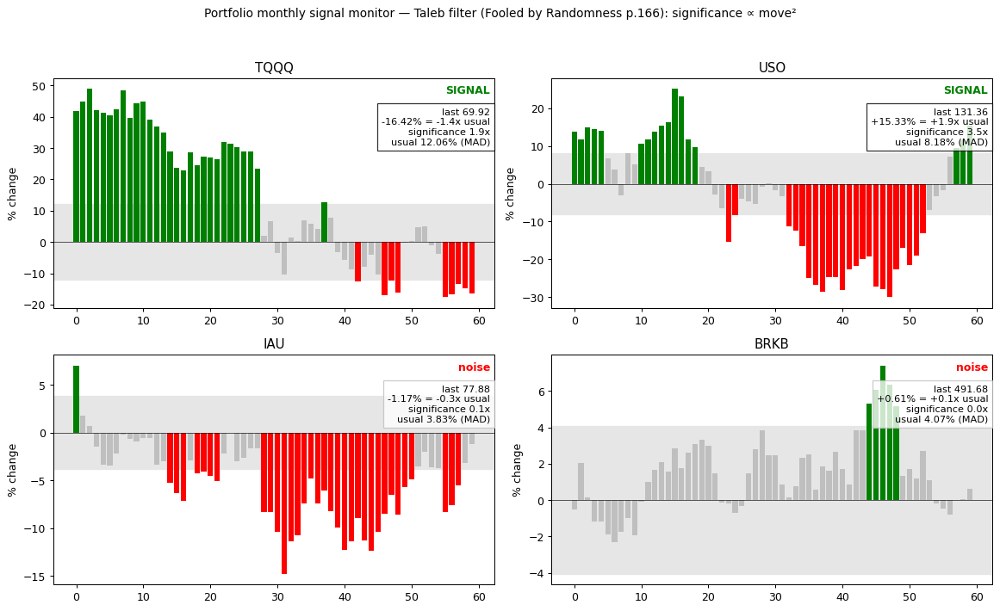
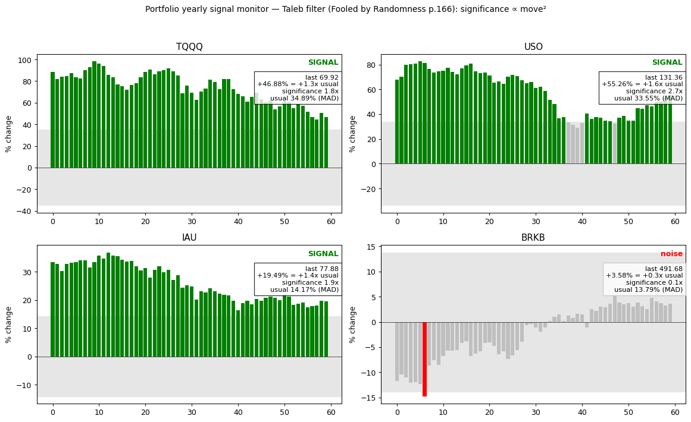

# 拨开花密柳繁处——提高生活信噪比的方法

> 落日鸟边下，秋云人外闲 —— 王维

花繁柳密处，拨得开，才是手段。随着AI信息和噪音生产速度加快，整个社会的连接度增加，我需要
更好地降噪手段，来提高生活的信噪比。充满噪音的生活，是焦虑而又神经质的，是不幸福的。

## 方法一：统计显著性降噪

概率论，起于赌博，兴于保险，壮于上世纪八十年代衍生品交易，可能死于人工智能。纵观保险公司、做市商、交易所、搜索公司到今天的大模型公司，它们在社会上承担两个功能：去除噪音，管理尾部风险(无论是坏的灾难还是意外的技术突破)。

> "诀窍在于只看大幅的百分比变动。除非某物的变动超过其日常百分比变动的正常范围，否则该事件就被视为噪音。"
> —— 塔勒布《随机漫步的傻瓜》

2026年当下海量信息背后蕴藏的是巨大的毒性，解毒的药方是无视一切统计不显著的噪音。

某个早晨，爱德华·索普在车里听到广播："道指下跌 9 点至 11,075，市场恐慌加息。"他心算：道指此时段的日常波动约 66 点；9 点不到七分之一，纯属家常便饭——市场安静得很，何来恐慌。

> "简单的数学让我能够把炒作与现实区分开来。"
> —— 爱德华·索普《战胜一切市场的人》

两位大师，同一把尺子：**以"日常波动"为分母**。变动不超一个 MAD，是噪音；超过，才算信号。且显著性按平方计：2% 不是 1% 的两倍，而是四倍。

我们把这把尺子钉在屏幕上——TQQQ、USO、IAU、BRKB 固定四角；灰色是噪音，红绿才是信号；日、月、年三个尺度各看一遍：

**`see_change daily portfolio`**

**`see_change monthly portfolio`**

**`see_change yearly portfolio`**

### 常见错误与心理解药

人们犯的错误千篇一律：把头条当尺度，把点数当幅度，把解释当知识。这是叙事谬误与线性直觉的合谋——道指跌 1.3 点也能配一篇惊悚报道，而它的意义不到 1987 年那种 7% 暴跌的百万分之一。记者和自媒体贩卖解释，因为解释按字数计费，一旦看了标题，你只肯寻找支持它的证据。

药方是执行意图（implementation intention），把规则预先写成"如果……那么……"，让未来的自己没有解释权：

- 如果变动小于一个 MAD，那么我不看新闻、不找解释、不操作。
- 如果变动达到两个 MAD，那么我按四倍显著性对待，先查凸性，再谈方向。
- 如果我忍不住要评论行情，那么我先报 MAD 倍数，再编故事。

我们无法本能地理解概率的非线性——所以把本能外包给规则。

## 方法二：循证医学的启示

循证医学对证据的强度和等级分出了金字塔一样的结构。专家的报告和多项随机双盲的元分析给出的结论当然要给予区别的对待。

对所有信息，不要急着解读信息本身，而是先观察信息的源头。观察它的证据等级、效应强度、样本数量、有没有利益冲突(人为财死)。

### 应用的细节：从N=30到N=1不能简单外推

负责人的医生会说对病人而言，只有0%和100%。把研究结论运用到自己身上，需要考虑自己独特的历史、行为以及自己在人群中的位置。

## 方法三：时间尺度

假设信息源相同，毫秒级的数据、分钟级的数据、和年度数据的信噪比是非常不一样的。用强度去换频率几乎总是划算的交易。

巴菲特的老师格雷厄姆(市场先生的提出者)会问:我下午1:24给房产经纪人打电话查房价了吗?我1:37又打回去问了吗?如果打了,价格会变吗?就算变了,我会急着把房子卖掉吗?不去每分钟查看、甚至根本不知道房子的报价,会阻碍它的价值随时间上涨吗?这些问题的答案当然都是"不会"!

你应当用同样的方式看待你的投资组合和生活中的信息——在10年、20年甚至30年的周期里,市场先生每天的来回波动根本无关紧要。塔勒布在《随机漫步的傻瓜》中更是用表格做了个定量的信噪比表格：

**Table 3.1 Probability of success at different scales(不同时间尺度下的成功概率,第3章,2nd ed. p.65)**

假设一个年化收益15%、年化波动率10%的策略:看年尺度,成功概率高达93%;但把时间尺度压到秒,成功概率就只有50.02%,和抛硬币无异。

| 时间尺度 | 成功概率 | 噪音/信号比 |
|---|---|---|
| 1 年 | 93% | 0.7 |
| 1 季度 | 77% | — |
| 1 月 | 67% | 2.32 |
| 1 天 | 54% | — |
| 1 小时 | 51.3% | 30 |
| 1 分钟 | 50.17% | — |
| 1 秒 | 50.02% | 1,796 |

"在很短的时间增量上,你观察到的是组合的波动性(variance),而不是收益(returns)。"同理,若每天盯盘,一年240个交易日中约239天会感到痛苦、241天感到愉悦,但痛苦与愉悦并不对等(负面的冲击约为正面的2.5倍)——高频查看不仅看不到信号,还在持续消耗情绪。

## 三管齐下

上述三种方法，本质上都是在做压缩，而压缩在这个时代即智能。如果在噪音巨大的系统中，最好的方法是*同时*用上这三种方法，三管齐下，去找五十年、一百年尺度内，随机过程中统计显著的跳变而非日常的波动而且被大量的人群用自我的组内实验或者组间设计证伪的信号。

## 参考文献

1. Graham, B., & Zweig, J. (2003). *The intelligent investor: The definitive book on value investing* (Rev. ed.). HarperBusiness.

2. Taleb, N. N. (2005). *Fooled by randomness: The hidden role of chance in life and in the markets* (2nd ed.). Random House.
