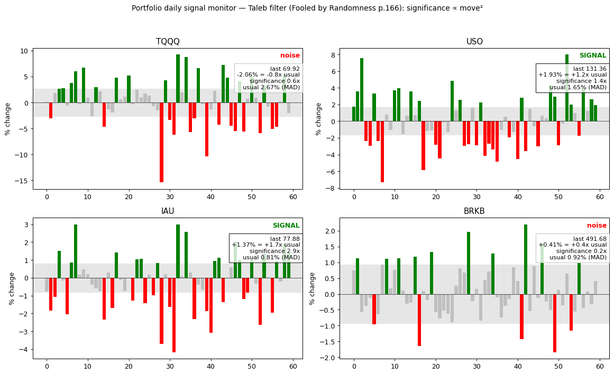
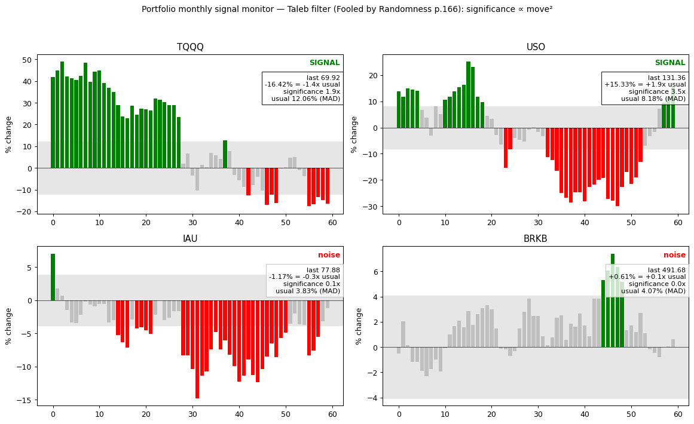
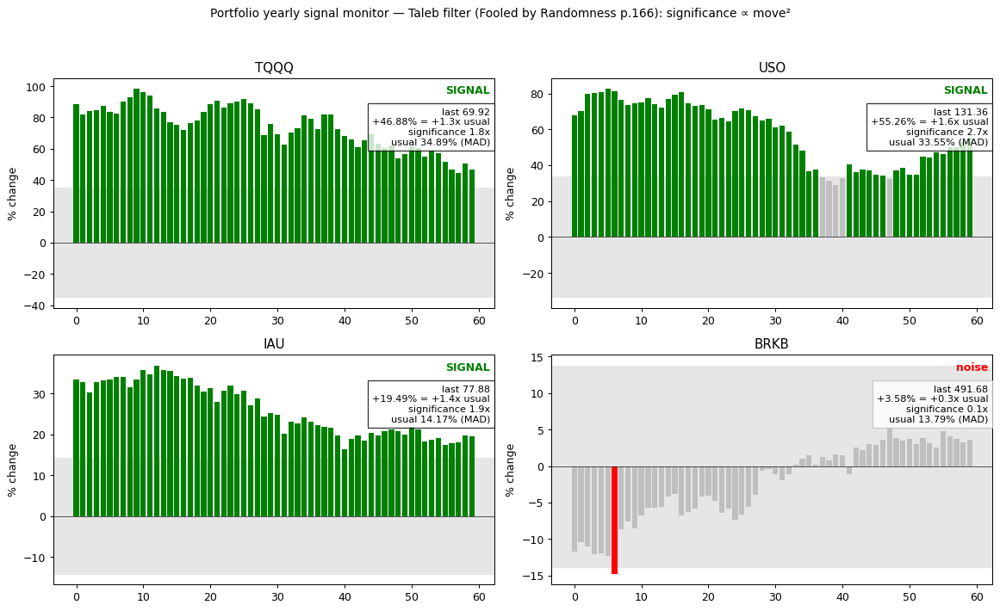

# 过滤噪音，看见非线性变化

> "The trick is to look only at the large percentage changes. Unless
> something moves by more than its usual daily percentage change, the
> event is deemed to be noise."
> —— 塔勒布《随机漫步的傻瓜》

> "The interpretation is not linear; a 2% move is not twice as
> significant an event as 1%, it is rather like four times."
> —— 同上

我有一个辨别世上是否真有事发生的诀窍。

某个早晨，爱德华·索普在车里听到广播："道指下跌 9 点至 11,075，市场恐慌加息。"他心算：道指此时段的日常波动约 66 点；9 点不到七分之一，纯属家常便饭——市场安静得很，何来恐慌。

> "Simple math allowed me to separate hype from reality."
> —— 爱德华·索普《战胜一切市场的人》

两位大师，同一把尺子：**以"日常波动"为分母**。变动不超一个 MAD，是噪音；超过，才算信号。且显著性按平方计：2% 不是 1% 的两倍，而是四倍。

我们把这把尺子钉在屏幕上——TQQQ、USO、IAU、BRKB 固定四角；灰色是噪音，红绿才是信号；日、月、年三个尺度各看一遍：

**`see_change daily portfolio`**

**`see_change monthly portfolio`**

**`see_change yearly portfolio`**

## 常见错误与心理解药

人们犯的错误千篇一律：把头条当尺度，把点数当幅度，把解释当知识。这是叙事谬误与线性直觉的合谋——道指跌 1.3 点也能配一篇惊悚报道，而它的意义不到 1987 年那种 7% 暴跌的百万分之一。记者贩卖解释，因为解释按字数计费；你无法向编辑交白卷说"今天无事发生"。更要命的是确认偏误：一旦看了标题，你只肯寻找支持它的证据。

药方是执行意图（implementation intention），把规则预先写成"如果……那么……"，让未来的自己没有解释权：

- 如果变动小于一个 MAD，那么我不看新闻、不找解释、不操作。
- 如果变动达到两个 MAD，那么我按四倍显著性对待，先查凸性，再谈方向。
- 如果我忍不住要评论行情，那么我先报 MAD 倍数，再编故事。

我们无法本能地理解概率的非线性——所以把本能外包给规则。
